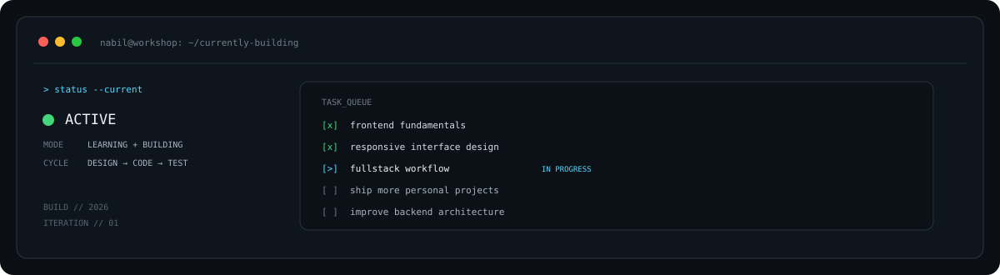

<div align="center">


</div>

<div align="center">

### `// DIGITAL WORKSHOP`

**Information Technology Student · Web Developer · UI/UX Explorer**

I build practical digital products, experiment with interfaces, and turn ideas into working systems.

</div>

<div align="center">


</div>

## `// about.system`

```txt
IDENTITY   :: Nabil Z. Danendra
ROLE       :: Information Technology Student
FOCUS      :: Web Development • UI/UX • Creative Tech
TOOLBOX    :: Code • Design • Problem Solving
WORKFLOW   :: Explore → Design → Build → Improve
LOCATION   :: Indonesia
```

I enjoy working where **design meets technology** — from shaping interfaces in Figma to turning them into functional web and application projects.

My current direction is to become more confident across the stack while keeping a strong eye for usability and visual detail.

---

## `// tech.stack`

<div align="center">


</div>

---

## `// workspace.stats`

<div align="center">


</div>

---

## `// projects.log`

<div align="center">


</div>

<div align="center">

**`01 / COOKCASH`** · [VIEW REPOSITORY →](https://github.com/Rikuyy/Aldente-Project)

**`02 / ROOMIO`** · [VIEW REPOSITORY →](https://github.com/nabeeldndraa/Website-Roomio)

</div>


---

## `// github.activity`

<div align="center">


</div>

---

## `// currently.building`

<div align="center">



</div>

---

## `// connect`

<div align="center">

[](https://github.com/nabeeldndraa)
[](https://instagram.com/)
[](https://linkedin.com/)

</div>

<div align="center">


</div>
