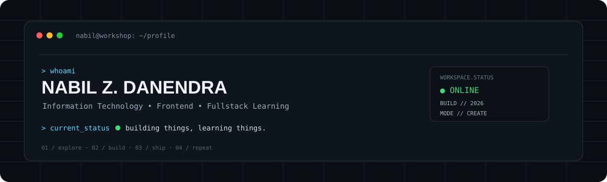
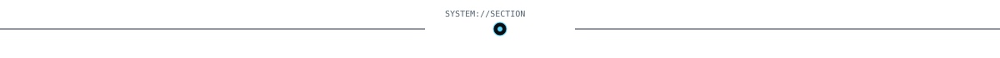
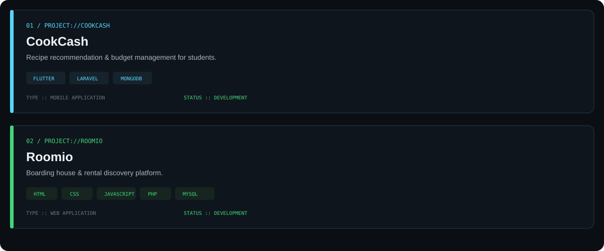
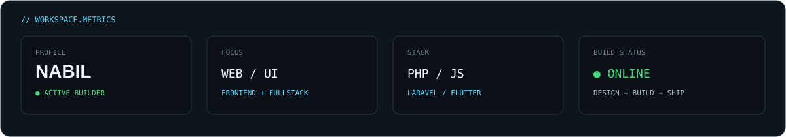
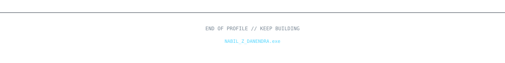

<div align="center">



</div>

<div align="center">

### `// DIGITAL WORKSHOP`

**Frontend enthusiast · Fullstack learner · Tech explorer**

I like turning ideas into interfaces, small systems, and experiments that actually work.

</div>

<div align="center">



</div>

## `// about.system`

```txt
NAME       :: Nabil Z. Danendra
ROLE       :: Information Technology Student
FOCUS      :: Frontend • Web Development • UI/UX
CURRENT    :: Learning + Building
WORKFLOW   :: Design → Build → Test → Improve
```

- Building clean and responsive web interfaces.
- Exploring fullstack development step by step.
- Interested in UI/UX, interactive systems, and practical software projects.
- Always experimenting with better ways to turn ideas into usable products.

---

## `// tech.stack`

<div align="center">


</div>

---

## `// projects.log`

<div align="center">



</div>

---

## `// workspace.stats`

<div align="center">



</div>

> This panel is intentionally local SVG, so it will load reliably without depending on an external stats service.

---

## `// currently.building`

```text
[■■■■■■■■■■■■■■■■□□]  80%

→ improving frontend fundamentals
→ exploring fullstack workflows
→ designing better interfaces
→ shipping personal projects
```

---

## `// connect`

<div align="center">

[](https://github.com/nabeeldndraa)
[](https://instagram.com/)
[](https://linkedin.com/)

</div>

<div align="center">



</div>
